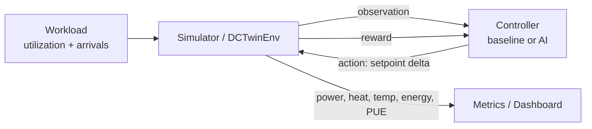
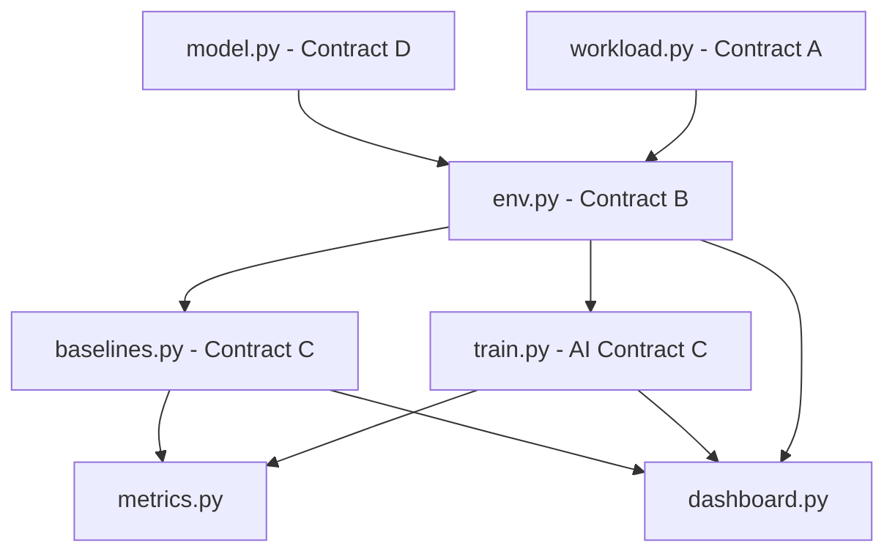

# DC-Twin — AI Agent Project Brief (machine-readable spec)

> **What this file is:** the single source of truth for an AI coding agent helping build
> **DC-Twin**, a datacenter cooling digital-twin + RL controller, during a hackathon.
> Drop this file in the repo root as `AGENTS.md` (or copy into `.github/copilot-instructions.md`
> for VS Code Copilot). It defines the goal, the contracts, the equations, the file map,
> and the per-module "definition of done" so the agent can implement any piece in isolation.

---

## 0. How the agent should use this file

- Treat **Section 8 (Data Contracts)** as hard interfaces. Never change a signature without
  flagging it as a **BREAKING CONTRACT CHANGE** in your response.
- When asked to implement a module, read its row in **Section 5**, its spec in **Section 9**,
  and the contracts it produces/consumes. Implement to the exact signatures given.
- All physics constants live in `model.py` (**Contract D**). Import them; never hard-code numbers
  elsewhere.
- Default stack: **Python 3.10+, Gymnasium, Stable-Baselines3 (PPO), NumPy, Plotly, Streamlit.**
- Prefer "rough but runnable" over "perfect but late." A working stub that honors a contract is
  worth more than an unfinished correct implementation.

---

## 1. Project in one line + shared mental model

**One line:** A software simulation of a datacenter rack + cooling system ("digital twin"), plus an
AI controller that learns to pick cooling setpoints that use less energy without overheating, proven
live against a dumb fixed-setpoint baseline on a dashboard.

**Mental model:** workload says how busy servers are → the simulator turns that into power, heat, and
temperature → the controller picks a cooling setpoint → the simulator computes energy used → repeat.
The AI's job is to pick setpoints that minimize energy while keeping temperatures safe and jobs on time.

---

## 2. The control loop (the one diagram everyone must know)



---

## 3. Win condition (acceptance criteria — memorize)

The project is a **WIN** when **all** of the following hold, measured by `metrics.py`:

| Criterion | Target |
|---|---|
| Cooling/total energy vs fixed baseline | **≥ 10% less energy** |
| Thermal violations (any zone temp > `T_MAX`) | **exactly 0** |
| SLA violations | **≤ baseline** (no worse) |
| Headline framing | multiply % saved by a **1 MW** datacenter → show **$ and CO₂ saved** |

Pitch sentence: *"The AI used X% less cooling energy than the fixed-setpoint baseline, with 0 thermal
violations and equal-or-better SLA."*

---

## 4. Glossary (precise definitions)

| Term | Symbol | Definition |
|---|---|---|
| Digital twin | — | Software model that behaves like the real rack + cooling. |
| Utilization | `u` | How busy a server/zone is, `0` (idle) → `1` (maxed). Drives power. |
| Setpoint | `T_supply` | Temperature of cold air the cooling pushes. **Main control variable.** |
| Coefficient of Performance | `COP` | Cooling efficiency. Higher `T_supply` → higher COP (cheaper) but hotter servers. |
| Power Usage Effectiveness | `PUE` | `P_total / P_IT`. `1.0` = perfect; real ≈ `1.1`–`1.6`. **Headline metric, lower is better.** |
| Service Level Agreement | `SLA` | Promise that jobs finish on time. Backed-up queue → SLA violation (bad). |
| Thermal violation | — | A zone temperature exceeds `T_MAX`. Must always be **0**. |
| Policy / agent | — | The AI. Observes state → takes action (setpoint) → gets reward → learns over many runs. |
| Baseline | — | Dumb controller to beat (fixed `20°C`). |

---

## 5. Repo layout & module ownership

| File | Role | Produces | Consumes | Owner archetype |
|---|---|---|---|---|
| `model.py` | Physics: power, thermal, cooling, PUE + constants | **Contract D** | — | "Chief Physicist" (ECE) |
| `workload.py` | Workload stream (synthetic + Azure trace) | **Contract A** | — | "Data Engineer" (CE#1) |
| `env.py` | Gymnasium env wiring physics + workload | **Contract B** | A, D | "Simulator/Systems" (CS#2) |
| `baselines.py` | Fixed + reactive controllers | **Contract C** | B | "Benchmark/Baselines" (CE#2) |
| `metrics.py` | Episode harness + comparison table | scoreboard | B, C | "Benchmark/Baselines" (CE#2) |
| `train.py` | PPO training → AI controller | **Contract C** (AI) | B | "RL Engineer" (CS#1) |
| `dashboard.py` | Streamlit demo: Baseline vs AI | demo | B, C | "Dashboard/Story" (CS#3) |

---

## 6. Dependency / build order



**Critical path = `env.py`.** Ship a rough runnable env with placeholder physics first; everyone else
unblocks off it, then swap in real physics. Every module also has a **"test alone"** path (Section 9)
using stubs/synthetic data so no one is ever blocked.

---

## 7. Physics model (Contract D source of truth)

All formulas live in `model.py`. `n` = number of zones. Per-zone utilization `u_i ∈ [0,1]`.

```text
# Power model (per zone), watts
P_it_i   = P_IDLE + (P_MAX - P_IDLE) * u_i
P_it_tot = sum_i(P_it_i)

# Thermal model (per zone), degrees C
T_i      = T_supply + R_TH * P_it_i

# Cooling model
COP      = COP_A + COP_B * T_supply          # higher setpoint -> higher COP -> cheaper
Q        = P_it_tot                           # all IT power becomes heat to remove
P_cool   = Q / COP

# Energy + efficiency
P_total  = P_it_tot + P_cool
PUE      = P_total / P_it_tot                 # == 1 + 1/COP
E_step   = P_total * dt_hours                 # kWh if P in kW
```

**Default constants (ECE finalizes; these are realistic placeholders):**

```python
# model.py  --- Contract D ---
N_ZONES        = 8
P_IDLE_W       = 150.0     # idle power per zone (W)
P_MAX_W        = 400.0     # max power per zone (W)
R_TH           = 0.02      # thermal resistance (degC per W)
COP_A          = 0.10      # COP intercept
COP_B          = 0.20      # COP slope vs T_supply  (COP = COP_A + COP_B*T_supply)
T_MAX          = 32.0      # thermal violation threshold (degC) — never exceed
T_SUPPLY_MIN   = 18.0      # coolest allowed setpoint (degC)
T_SUPPLY_MAX   = 27.0      # warmest allowed setpoint (degC)
T_SUPPLY_INIT  = 20.0      # baseline fixed setpoint (degC)
MAX_DELTA_C    = 1.0       # max setpoint change per step (degC)
DT_HOURS       = 1/60.0    # one step = 1 minute
# Sanity with defaults: COP(20)=4.1 -> PUE=1.24 ; COP(27)=5.5 -> PUE=1.18 ; full-load rise=R_TH*P_MAX=8C
```

**Validation requirement:** produce one PNG chart showing that as `T_supply` rises `18→27°C`,
`P_cool` drops while `max(T_i)` climbs (proves the trade-off exists). Justify constants against
published ranges (PUE ≈ 1.1–1.6, COP ≈ 3–6).

---

## 8. Data contracts (hard interfaces — code to these exactly)

### Contract A — Workload → Simulator (`workload.py` produces, `env.py` consumes)

```python
import numpy as np
from typing import Iterator, Literal, NamedTuple

class WorkloadStep(NamedTuple):
    util: np.ndarray   # shape (N_ZONES,), dtype float32, each value in [0.0, 1.0]
    arrivals: float    # number of new jobs arriving this step, >= 0.0

def load_workload(
    source: Literal["synthetic", "azure"] = "synthetic",
    n_zones: int = 8,
    horizon: int = 1440,        # steps per episode (1440 min = 1 day at DT_HOURS=1/60)
    seed: int = 0,
) -> list[WorkloadStep]:
    """Return a deterministic (given seed) list of length `horizon`.
    synthetic = daily sinusoid + noise + occasional spikes (MUST work offline).
    azure     = parsed Azure Public VM trace, bucketed into n_zones, normalized to [0,1]."""
```

Synthetic generator reference shape:
```text
base_i(t) = 0.5 + 0.35*sin(2*pi*(t/horizon) - phase_i)   # daily curve, per-zone phase
util_i(t) = clip(base_i(t) + noise + spike, 0, 1)
arrivals(t) = scale * mean_i(util_i(t))                   # busier -> more jobs
```

### Contract B — Simulator / Gym env (`env.py` produces; `train.py`, `metrics.py`, `dashboard.py` consume)

Gymnasium API. Observation and action are fixed-shape float32 arrays.

```python
import gymnasium as gym
from gymnasium import spaces
import numpy as np

class DCTwinEnv(gym.Env):
    """Datacenter cooling digital twin.

    observation (shape = 2*N_ZONES + 2):
        [ u_0..u_{n-1},          # utilization per zone, [0,1]
          T_0..T_{n-1},          # temperature per zone (degC), normalized or raw (document choice)
          T_supply_norm,         # current setpoint mapped to [0,1] over [T_SUPPLY_MIN, T_SUPPLY_MAX]
          queue_norm ]           # SLA queue length normalized to [0,1]
    action (shape = 1):
        delta in [-1, 1]  ->  T_supply += delta * MAX_DELTA_C, then clipped to [MIN, MAX]
    """
    observation_space: spaces.Box   # low/high consistent with the layout above
    action_space: spaces.Box        # Box(-1.0, 1.0, shape=(1,), float32)

    def reset(self, *, seed: int | None = None, options: dict | None = None
              ) -> tuple[np.ndarray, dict]:
        ...  # returns (obs, info)

    def step(self, action: np.ndarray
             ) -> tuple[np.ndarray, float, bool, bool, dict]:
        ...  # returns (obs, reward, terminated, truncated, info)
```

**`info` dict — REQUIRED keys every step (consumed by metrics + dashboard):**
```python
info = {
    "step_energy_kWh":   float,   # energy used this step
    "energy_kWh":        float,   # cumulative episode energy
    "pue":               float,   # this step's PUE
    "p_it_total_w":      float,
    "p_cool_w":          float,
    "temps":             np.ndarray,  # shape (N_ZONES,), degC
    "max_temp":          float,
    "t_supply":          float,   # current setpoint, degC
    "thermal_violations": int,    # cumulative count of zone-temp > T_MAX events
    "sla_violations":    int,     # cumulative count
    "queue_len":         float,
}
```

### Contract C — Controller (`baselines.py` + `train.py` produce; `metrics.py` + `dashboard.py` consume)

Baseline and AI are **interchangeable**: both map an observation to an action.

```python
import numpy as np
from typing import Protocol

class Controller(Protocol):
    def __call__(self, obs: np.ndarray) -> np.ndarray:
        """obs -> action (np.ndarray shape (1,), values in [-1, 1]). Stateful controllers
        may keep internal state but MUST expose reset()."""
    def reset(self) -> None: ...
```

### Contract D — Physics constants (`model.py` owns; everyone imports, nobody else edits)

See Section 7. Import as `from model import P_IDLE_W, P_MAX_W, R_TH, COP_A, COP_B, T_MAX, ...`.

> **Golden rule:** changing any contract affects someone else — announce it as a
> **BREAKING CONTRACT CHANGE** before proceeding.

---

## 9. Module specs (purpose · API · test-alone · definition of done)

### `model.py` — physics (no dependencies; build first)
- **Purpose:** turn "busy server" into watts and degrees; own every number.
- **API:** constants from Section 7 + pure functions:
  ```python
  def it_power(util: np.ndarray) -> np.ndarray            # per-zone watts
  def zone_temps(t_supply: float, p_it: np.ndarray) -> np.ndarray
  def cop(t_supply: float) -> float
  def cooling_power(p_it_total: float, t_supply: float) -> float
  def totals(p_it: np.ndarray, t_supply: float) -> tuple[float, float, float]  # (P_it_tot, P_cool, PUE)
  ```
- **Test alone:** assert `cooling_power` decreases as `t_supply` rises; assert `PUE in (1.0, 2.0)`.
- **Done:** constants finalized + one-paragraph justification + validation trade-off PNG saved.

### `workload.py` — workload stream (no dependencies; build synthetic first)
- **Purpose:** produce the "how busy are servers now" stream that drives everything.
- **API:** `load_workload(...)` per **Contract A**.
- **Test alone:** synthetic returns `horizon` items, each `util ∈ [0,1]`, works offline; plot a believable daily curve.
- **Done:** both sources return identical format; synthetic 100% offline; daily load-curve plot.

### `env.py` — simulator (CRITICAL PATH; ship rough version ASAP)
- **Purpose:** wire workload + physics into a Gymnasium env per **Contract B**.
- **step() order:** apply setpoint delta → pull this step's `WorkloadStep` → call `model.py` formulas →
  update SLA queue → compute reward (Section 10) → fill full `info` dict → advance index.
- **Test alone:** `reset()` then 5× `step(action=0)`; print PUE (~1.1–1.6) and temps; assert no crash.
- **Done:** full episode runs without crashing, returns complete `info`, behaves sensibly
  (busier load → higher temps → more cooling power). Tag a version others pin to.

### `baselines.py` — dumb controllers (Contract C)
- **Fixed:** always returns `action = [0.0]` → holds `T_SUPPLY_INIT` (20°C). Main comparison.
- **Reactive:** if `max_temp` near `T_MAX` → push setpoint down; else relax it up. Smarter strawman.
- **Test alone:** run against a `StubEnv` honoring Contract B; confirm fixed never changes setpoint.
- **Done:** both run end-to-end through `metrics.py`; can print a baseline-vs-baseline table.

### `metrics.py` — scoreboard
- **API:**
  ```python
  @dataclass
  class EpisodeResult:
      energy_kWh: float; avg_pue: float; thermal_violations: int
      sla_violations: int; steps: int
  def run_episode(env, controller: Controller, seed: int = 0) -> EpisodeResult
  def compare(baseline: EpisodeResult, ai: EpisodeResult) -> dict
      # -> {"pct_energy_saved", "delta_pue", "thermal_violations_ai", "sla_delta", ...}
  ```
- **Done:** prints baseline-vs-AI "money table": % energy saved, ΔPUE, violation counts.
- **Stretch:** extrapolate saved kWh to a 1 MW facility × grid carbon intensity → $ and CO₂.

### `train.py` — the AI (Contract C)
- **Purpose:** PPO (Stable-Baselines3) ~300k steps; tune reward weights `λ_T`, `λ_S` (Section 10).
- **API:** train, save policy, expose `def ai_controller(obs) -> action` honoring **Contract C**.
- **Test alone:** confirm mean reward trends up (print every 10k steps); after training agent should
  raise setpoint at low load and drop it before temps approach `T_MAX`.
- **Done:** saved policy that via `metrics.py` shows **≥10% energy savings, 0 thermal violations**.
- **Fallback (decide by Day 2 noon):** if PPO is unstable, ship Bayesian optimization or a tuned
  heuristic as "the AI" — same pitch, PPO becomes a stretch.

### `dashboard.py` — demo (Streamlit)
- **Purpose:** two columns, **Baseline vs AI**, Play button steps both in lockstep.
- **Shows:** zone temperature heatmap (Plotly), live energy + PUE, violation counters, and a big
  headline metric, e.g. `▼14.2% energy | PUE 1.42 → 1.21 | 0 violations`.
- **Test alone:** run with two baselines (fixed vs reactive) in the two columns; swapping in the AI
  controller is a one-line change.
- **Done:** runs offline, both columns animate, headline updates, deck complete, backup video recorded.

---

## 10. Reward design (env.py + train.py)

```text
reward = -w_E * E_step_norm
         - LAMBDA_T * sum_i( max(0, T_i - T_MAX)^2 )     # safety: overheating penalty
         - LAMBDA_S * sla_violations_this_step            # on-time jobs
```
- `E_step_norm` = step energy scaled to ~O(1) for stable learning.
- The RL engineer's craft = choosing `LAMBDA_T`, `LAMBDA_S` so the agent **never trades safety for energy**.
- Start large: `LAMBDA_T >> w_E` so any thermal violation dominates the reward.

---

## 11. Working agreements (keep the team un-stuck)

1. **Respect the contracts.** Never change a shared interface without announcing it.
2. **Rough first, real later.** A working fake (stub env, synthetic workload, do-nothing controller)
   beats a perfect thing that arrives at hour 47.
3. **Stop building Day 2 mid-afternoon.** Then polish + rehearse. A great demo of a simple result
   beats a broken demo of a complex one.

---

## 12. Stretch goals (only after the win condition is met)

- **ECE:** outside-air-temperature term so `COP` varies with time of day; fan-power curve.
- **CE#1:** per-zone heterogeneity (hotspots the AI must manage); second trace (Google/Alibaba).
- **CE#2:** $ and CO₂ extrapolation to a 1 MW facility.
- **CS#1:** second action = workload consolidation (pack load onto fewer servers, manage hotspots).
- **CS#2:** grow Contract B action to 2-D (setpoint + placement); per-zone heat coupling.
- **CS#3:** live workload slider so judges change load and watch the AI adapt.
