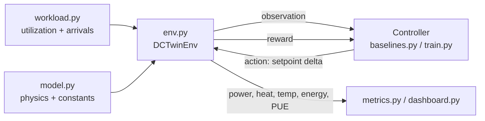
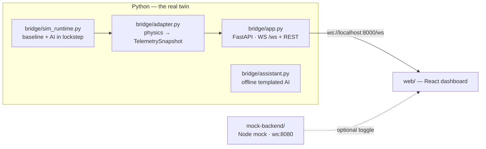

# DC-Twin — datacenter cooling digital twin + RL controller

A software **digital twin** of a datacenter rack + cooling system, plus an **AI
controller** that learns to pick cooling setpoints that use less energy without
overheating — proven live against a dumb fixed-setpoint baseline on a dashboard.

> **One line:** workload says how busy servers are → the simulator turns that into
> power, heat, and temperature → the controller picks a cooling setpoint → the
> simulator computes energy used → repeat. The AI minimizes energy while keeping
> temperatures safe and jobs on time.

See [AGENTS.md](AGENTS.md) for the full machine-readable spec (contracts, physics,
reward design, module "definition of done").

---

## Win condition

Measured by [metrics.py](metrics.py), the project is a **WIN** when **all** hold:

| Criterion | Target | Status |
|---|---|---|
| Cooling energy vs fixed baseline | **≥ 10% less** | ✅ achieved (heuristic ~12%, PPO trained) |
| Thermal violations (zone temp > `T_MAX`) | **exactly 0** | ✅ 0 |
| SLA violations | **≤ baseline** | ✅ equal |
| Headline | % saved × 1 MW facility → **$ + CO₂** | ✅ in money table |

**Pitch:** *"The AI used ~12% less cooling energy than the fixed-setpoint baseline,
with 0 thermal violations and equal-or-better SLA — about $30k and 100 tonnes of
CO₂ saved per year on a 1 MW datacenter."*

---

## Architecture



| File | Role |
|---|---|
| [model.py](model.py) | Physics: power, thermal, cooling, PUE + all constants (**Contract D**) |
| [workload.py](workload.py) | Workload stream — synthetic (offline) + Azure trace (**Contract A**) |
| [env.py](env.py) | Gymnasium env wiring physics + workload (**Contract B**) |
| [baselines.py](baselines.py) | Fixed + reactive controllers (**Contract C**) |
| [metrics.py](metrics.py) | Episode harness + baseline-vs-AI money table |
| [train.py](train.py) | PPO controller (the AI) + greedy-safe fallback (**Contract C**) |
| [dashboard.py](dashboard.py) | Streamlit demo: Baseline vs AI, side by side |

---

## Quick start

```powershell
# 1) create the environment and install deps
python -m venv .venv
.\.venv\Scripts\Activate.ps1
pip install -r requirements.txt

# 2) sanity-check each module (each runs its own self-test)
python model.py        # physics + saves validation_tradeoff.png
python workload.py     # workload + saves workload_curve.png
python env.py          # env smoke test
python baselines.py    # controllers
python metrics.py      # baseline-vs-reactive money table
python metrics.py --pue-check  # emergent-PUE realism check vs published bands

# 3) the AI
python train.py --heuristic        # instant: greedy-safe fallback AI (WIN)
python train.py --timesteps 200000 # train PPO, then print the money table
python train.py --eval-only        # evaluate a previously trained PPO

# 4) the demo
streamlit run dashboard.py
```

On Linux/macOS, activate with `source .venv/bin/activate` instead.

---

## Web showcase — ThermaMind UI driven by the real twin

The Streamlit dashboard is the analyst view. For the **demo**, the same digital twin
also powers a polished React control-room UI (**ThermaMind**) through a thin FastAPI
**bridge** — so the gorgeous dashboard shows *real* RL telemetry, not mocks.



| File | Role |
|---|---|
| [bridge/sim_runtime.py](bridge/sim_runtime.py) | Steps the fixed baseline and the AI **in lockstep**, accumulates real savings/PUE/violations |
| [bridge/adapter.py](bridge/adapter.py) | Maps per-zone physics → ThermaMind's exact `TelemetrySnapshot` (8 clusters × 8 nodes, geo sites) |
| [bridge/assistant.py](bridge/assistant.py) | Offline, templated voice/chat assistant grounded in live telemetry (no cloud keys) |
| [bridge/app.py](bridge/app.py) | FastAPI: streams telemetry over `WS /ws`, plus `/api/optimize` and `/api/simulate-load-spike` |
| [web/](web) | ThermaMind React + Vite dashboard (heatmap, charts, map, assistant) |
| [mock-backend/](mock-backend) | The original Node mock simulator, kept as-is (optional fallback) |

### Run the web demo

```powershell
# one command: launches the bridge (8000) + the React UI (5173) in separate windows
.\start-dev.ps1

# add the original Node mock backend on 8080 as well:
.\start-dev.ps1 -Mock
```

Then open **http://localhost:5173**. Or run the pieces manually:

```powershell
# terminal 1 — the real twin bridge
.\.venv\Scripts\Activate.ps1
python -m uvicorn bridge.app:app --port 8000

# terminal 2 — the dashboard
cd web
npm install      # first time only
npm run dev
```

### Real vs. mock toggle

The frontend picks its data source from `web/.env`:

```ini
VITE_WS_URL=ws://localhost:8000/ws   # real DC-Twin bridge (default)
# VITE_WS_URL=ws://localhost:8080    # original Node mock simulator
```

Everything runs **fully offline**. The default 📊 list view needs no network;
the optional 🌎 map view activates only if you add `VITE_MAPBOX_ACCESS_TOKEN`
to `web/.env`. The assistant is templated and key-free, narrating the live
PPO controller's setpoint, savings, PUE, and hottest/coolest clusters.

The bridge runs the twin with the outside-air economizer **on by default**, so the PUE
card shows a `✓ within published 1.1–1.6 band` chip plus the live outside-air temperature,
and the assistant explains the economizer on request. Tune the bridge with env vars:
`DCTWIN_OUTSIDE_AIR=0` disables the economizer, `DCTWIN_SOURCE=azure` drives it from the
real Azure trace (falls back to an offline bursty trace if absent), and `DCTWIN_AI`,
`DCTWIN_TICK_SECONDS`, `DCTWIN_STEPS_PER_TICK` tune the controller and animation cadence.

---

## How it works

### Physics ([model.py](model.py) — Contract D)
```text
P_it_i  = P_IDLE + (P_MAX - P_IDLE) * u_i        # per-zone IT power (W)
T_i     = T_supply + R_TH * P_it_i               # per-zone temperature (°C)
COP     = COP_A + COP_B * T_supply               # higher setpoint → cheaper cooling
        + COP_OUTSIDE_K * (T_OUTSIDE_REF - T_out)  # optional free-cooling economizer
P_cool  = P_it_tot / COP                         # cooling power (W)
PUE     = (P_it_tot + P_cool) / P_it_tot         # == 1 + 1/COP
```
With the default constants: `COP(20°C)=4.1 → PUE 1.24`, `COP(27°C)=5.5 → PUE 1.18`,
and a full-load zone rises `R_TH·P_MAX = 8°C` above the setpoint. Raising the
setpoint is cheaper (higher COP) but hotter — that is the trade-off the AI exploits.
`validation_tradeoff.png` proves it visually.

### Realism & credibility
Two features keep the twin defensible against real-world numbers:

- **Outside-air economizer** — enable with `DCTwinEnv(outside_air=True)`. COP gains a
  free-cooling term `COP_OUTSIDE_K · (T_OUTSIDE_REF − T_out)` (floored at `COP_MIN`),
  where `T_out` follows a diurnal sinusoid (coolest ~05:00, warmest ~17:00). Cooler
  outside air → cheaper cooling → lower PUE, exactly like a real chiller running an
  economizer. It is **opt-in and observation-shape-preserving**, so trained PPO policies
  still load unchanged — it only affects COP/PUE/energy via the `info` dict, never `obs`.
- **Emergent-PUE cross-check** — `python metrics.py --pue-check` runs the twin on a real
  Azure workload slice and prints the *emergent* average PUE against the published
  hyperscale band (1.10–1.60) and Microsoft's tighter fleet band (1.12–1.18). The PUE is
  never hard-coded — it falls out of the physics — so landing inside the published band is
  evidence the model behaves like a real datacenter.

### The controllers (Contract C)
- **Fixed baseline** — always holds 20 °C (the thing to beat).
- **Reactive** — cools when a zone nears `T_MAX`, relaxes when cool (strawman).
- **PPO (the AI)** — Stable-Baselines3 PPO trained on the twin; learns to raise the
  setpoint during low-load troughs and drop it before any zone approaches `T_MAX`.
- **Greedy-safe heuristic** — model-predictive fallback that each step picks the
  warmest setpoint keeping the hottest zone a safety margin below `T_MAX`.
  Reliably clears the win condition; a valid stand-in "AI" per the AGENTS.md fallback.

### Reward ([env.py](env.py) — Section 10)
```text
reward = -W_E * E_step_norm
         - LAMBDA_T * Σ max(0, T_i - T_MAX)²     # safety dominates (LAMBDA_T ≫ W_E)
         - LAMBDA_S * sla_violations_this_step
```

---

## Artifacts produced
- `validation_tradeoff.png` — setpoint vs cooling-power / hottest-zone trade-off.
- `workload_curve.png` — a believable daily load curve.
- `ppo_dctwin.zip` — the trained PPO policy (after `python train.py`).

---

## Stretch goals (AGENTS.md Section 12)
✅ **Done:** outside-air COP economizer + emergent-PUE realism cross-check.
Remaining: per-zone heterogeneity, a second workload trace, workload consolidation
as a second action, and a live load slider in the dashboard.
