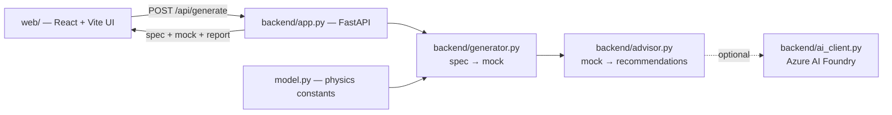

# EcoTwin — environment-first datacenter advisor

Describe a datacenter in plain numbers and EcoTwin will **(1)** generate a
physics-grounded mock of the facility as it stands today, then **(2)** rank
concrete upgrades by the carbon they cut — environment first, cost second.

```
 input specs ─▶ context for the model ─▶ generated mock (phase 1) ─▶ in-depth, env-first upgrades
 clusters,        spec handed to the        per-cluster power,          ranked by CO₂ avoided,
 sqft, cooling,   generator + advisor       cooling, PUE, temps,        with energy/$/water and
 climate, power   (and the AI model)        annual energy/CO₂/water     an AI-written summary
```

Everything runs **fully offline**: with no AI configured the advisor uses a
deterministic rule engine. Wire in an Azure AI Foundry model and it additionally
writes the executive narrative grounded in the same numbers.

---

## Architecture



| File | Role |
|---|---|
| [model.py](model.py) | Physics constants + functions (power, thermal, COP, PUE). Reused by the generator. |
| [backend/schemas.py](backend/schemas.py) | The data contracts: `DatacenterSpec` → `DatacenterMock` → `OptimizationReport`. |
| [backend/generator.py](backend/generator.py) | Turns a spec into the generated mock (phase 1): per-cluster power, cooling, PUE, temps, annual footprint. |
| [backend/advisor.py](backend/advisor.py) | Environment-first rule engine + AI executive summary. Quantifies every upgrade in tonnes of CO₂/yr. |
| [backend/ai_client.py](backend/ai_client.py) | **The one place to plug in your AI model** (Azure AI Foundry). |
| [backend/app.py](backend/app.py) | FastAPI service: `POST /api/generate`, `GET /health`. |
| [web/](web) | React + Vite UI: spec form, generated-mock floor map, ranked report. |

---

## Quick start

```powershell
# 1) backend
python -m venv .venv
.\.venv\Scripts\Activate.ps1
pip install -r requirements.txt
python -m uvicorn backend.app:app --port 8000 --reload

# 2) frontend (new terminal)
cd web
npm install
npm run dev        # http://localhost:5173
```

Or launch both at once:

```powershell
.\start-dev.ps1
```

On Linux/macOS activate the venv with `source .venv/bin/activate`.

---

## Plugging in your AI model (Azure AI Foundry)

EcoTwin calls **one function** — `ai_complete()` in
[backend/ai_client.py](backend/ai_client.py). To enable it:

1. Deploy a chat model on Azure AI Foundry.
2. Paste the deployment's **endpoint** and **key** into `FOUNDRY_ENDPOINT` /
   `FOUNDRY_API_KEY` at the top of `backend/ai_client.py` (or set them as env
   vars). For a serverless deployment also set `FOUNDRY_MODEL`.
3. Restart the backend. `GET /health` now reports `"ai_configured": true` and the
   report's executive summary is authored by your model. `POST /api/generate`
   always returns fully-quantified recommendations either way.

The endpoint must be the **full chat-completions URL**, e.g.
`https://<resource>.services.ai.azure.com/models/chat/completions?api-version=2024-05-01-preview`.

> Hardcoding a key is fine for a hackathon; prefer env vars for anything shared.

---

## How the numbers are produced

**Generated mock (phase 1).** Each rack draws an idle floor plus a load-scaled
share of its nameplate density. Cooling power follows the plant's effective COP
(set by the cooling technology and boosted by the climate's free-cooling
potential), and a redundancy-dependent power-chain loss is added on top. From the
totals come PUE, annual energy, cost, CO₂ (grid intensity discounted by the
renewable share) and evaporative water use. Clusters are spread around the fleet
average so the floor map shows real hotspots — all deterministic, no RNG.

**Environment-first report.** A rule engine proposes upgrades that fit the spec
(raise the setpoint, add an economizer, contain aisles, go liquid for dense
racks, procure clean power, consolidate idle load, reuse waste heat, cut cooling
water, modernize the power chain, add AI control). Each is quantified in
kWh/CO₂/$/water per year, then the whole list is **sorted by CO₂ avoided** and the
combined potential is capped so overlapping measures never exceed what is
physical.

---

## Customize

- **Cooling / climate assumptions** — `COOLING_PROFILES` and `CLIMATE_PROFILES`
  in [backend/generator.py](backend/generator.py).
- **Carbon & price defaults** — `BASE_GRID_CARBON_KG_PER_KWH`,
  `DEFAULT_PRICE_USD_PER_KWH` (also overridable per request in the spec).
- **Recommendation logic** — `deterministic_recommendations()` in
  [backend/advisor.py](backend/advisor.py).
- **Physics constants** — [model.py](model.py).
